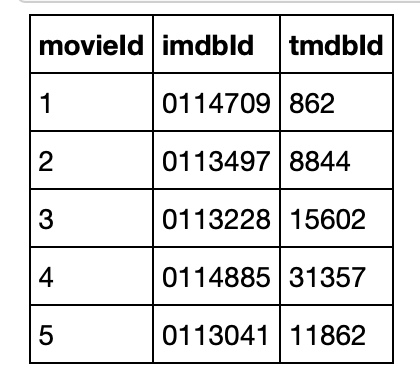
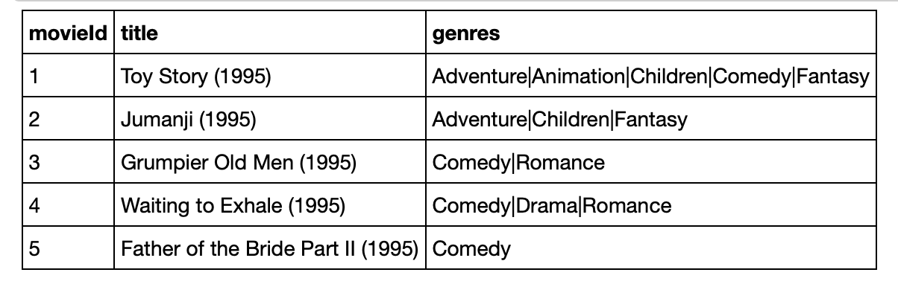
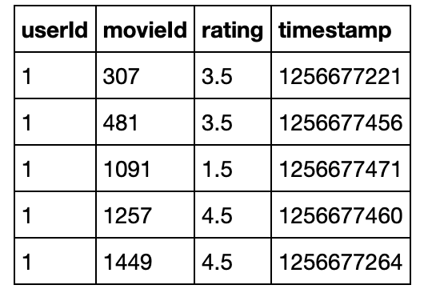
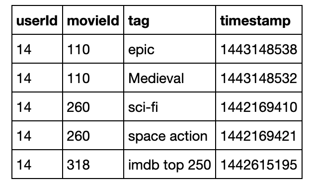
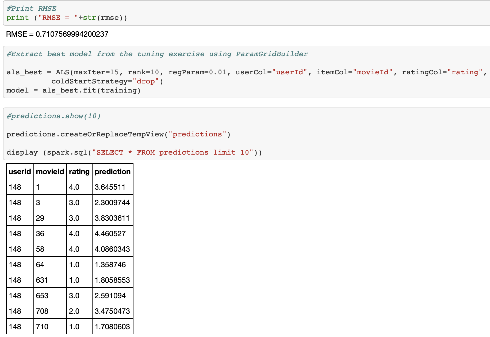
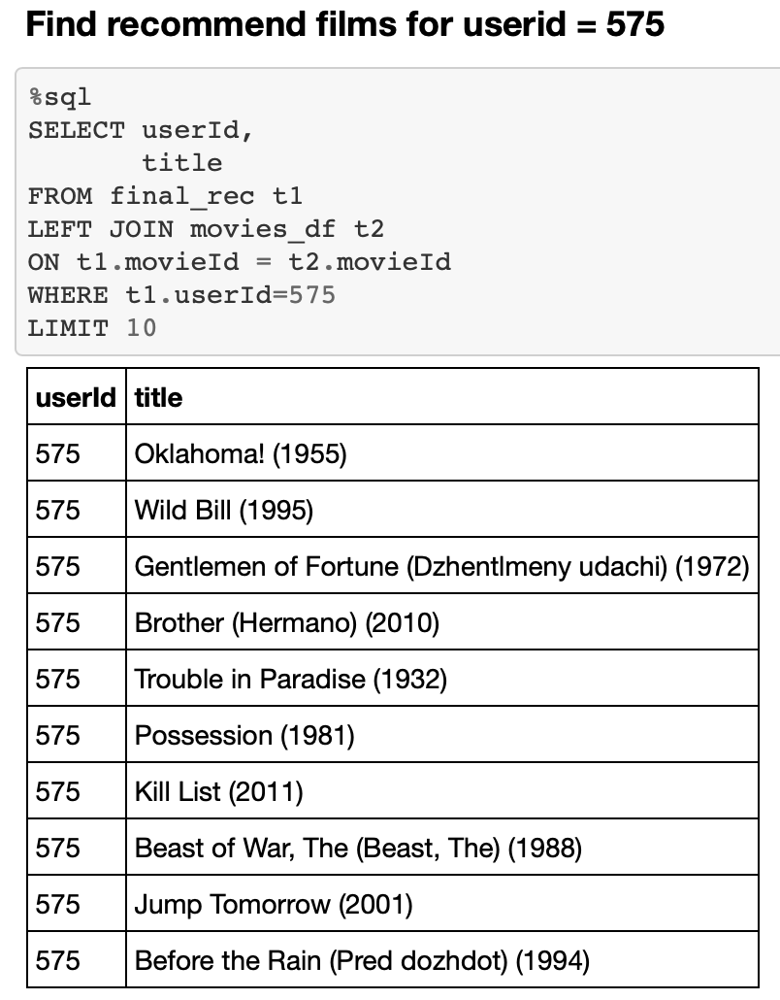

# Movie Recommendation Engine in Apache Spark

<a href="https://github.com/joshlingy/Movie-Recommendation-Engine-in-Apache-Spark/blob/master/Movie Recommendation Engine in Apache Spark.ipynb">Highly recommended to click this link to see more detail of what I have done about this project!</a>

** Please reload it if something went wrong on the page.**

In this notebook, Alternating Least Squares (ALS) algorithm will be used with Spark APIs to predict the ratings for the movies in [MovieLens small dataset](https://grouplens.org/datasets/movielens/latest/)

# Motivation:
I dig deep into ALS collaberative recommendation engine by using Spark MLlib and give recommendation with user based movie recommendation with a scalable matrix factorization technique.

* Step1
First I load four of datasets, namely movie, rating, links and tags and conduct a number of data explorations on these data to get some basic information, such as number of users, number of movies, number of ratings per users and per movies respectively, and distribution of movies on different genres.

* Step2
After doing data preprocessings, I build an ALS model based on the rating data to predict the ratings, which is treated as degree of preference of movies among different users. The parameters (maxIter, rank, regParam) are tuned by grid search strategy via 5-fold cross validation to obtain the model with the smallest RMSE on the validation set. This is considered to be the best model for prediction.

* Step3
By the best model obtained from the above step, making predictions of ratings on movies in the test set and calculating the RMSE to evaluate the model performance are preparing for the next step.

* Step4
In this step, I use the prediction results by the best model to recommend 5 movies for userID 575 and 232 respectively; and we also find 5 movies that are the most similar to movie with movieID 471 and 463 by the approximate nearest neighbor search algorithm on the movie feature vector.

#Conclusion
The RMSE of the best ALS model on the test data is 0.71, indicating the model is with good performance in predicting the ratings for movies; ALS model is able to provide both recommendations of movies based on user's preferences and also similar movies to a specific movie, which shows its effectiveness as one of most critical techniques in recommendation system. More works can be considered to further improve the model performance, such as making use of information from other data sets such as genres of movies and tag information, building ALS model incorporatng both explicit and implicit feedbacks, and try some other techniques such as KNN, Deep Learning, applying ensemble based on several methods, and so on.

# Feature Engineering with Spark

To scale the feature engineering to a large dataset, the data was partitioned and automated feature engineering was run in parallel
using Apache Spark with PySpark. 

